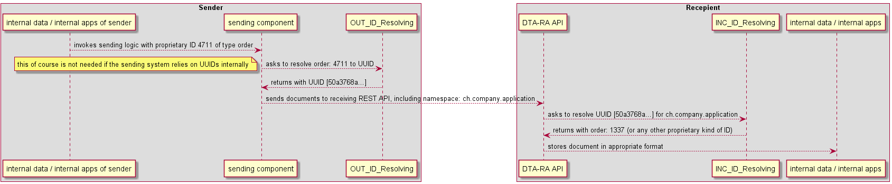

# dta-ra (Draft)

Format für Datenträgeraustausch für Reparaturaufträge in der Immobilienwirtschaft

Dieses Dokument beschreibt ein Format für den Austausch von Informationen zu Schadensmeldungen und Reparaturaufträgen. Der Standard wurde entwickelt für den Austausch von Schadensmeldungen mit ERP Anwendungen der W&W Immo Informatik und der Service 7000. Der Standard darf frei verwendet werden.

## Entitäten

Für den Austausch gibt es zwei Typen von Dokumenten mit den gleichen grundlegenden Entitäten.

- [Schadensmeldung](damagenotification.md)
- [Reparaturauftrag](repairorder.md)

Allgemeine Entitäten

- [Schaden](entities/damage.md)
- [Standort](entities/location.md)
- [Person](entities/person.md)

## Format

Das Format definiert die Struktur einer Meldung.
Als Format für den Datenaustausch ist [JSON](https://de.wikipedia.org/wiki/JavaScript_Object_Notation) angedacht. Der Vorteil liegt in der Verarbeitung der Daten auf Client-Seite (Apps und Web-Portale). Theoretisch könnte auch XML verwendet werden.

### Umgang mit NULL-Werten

Pflicht-Attribute müssen immer angegeben werden, sonst ist die Meldung nicht gültig.
Optionale Attribute können einfach weggelassen werden und müssen nicht aufgeführt werden.

### Validierung/SDK

Für die Überprüfung der Gültigkeit einer Meldung könnte ein kleines SDK entwickelt werden, welche eine Validierungsfunktion für die Meldungen zur Verfügung stellt. Dies würde sicherstellen, dass das Format überall konform eingesetzt wird.

- Soll ein TypeScript-SDK erstellt werden?
- Soll eine kleine Webseite mit einfachem Validator erstellt werden? (Analog zu [jwt.io](https://jwt.io))
- Soll ein .NET Standard-SDK erstellt werden?

Mögliche Funktionen:

- Validierung
- Bilder für Base64 de- und encodieren

## Offene Fragen

Aktuell sind noch einige Fragen offen.

### Liste der Hersteller (manufacturer)

Sollen die Hersteller analog der Gerätetypen und Raumtypen auch aufgelistet werden?
-> Service 7000 lieferte Liste
-> die Liste der Hersteller ist sehr umfangreich und schwer zu verwalten
-> Soll anstelle einer definierten Liste mit Firmen-eigenen Listen gearbeitet werden? Dies könnte durch das neue ID-Konzept einfach ermöglicht werden.

### Wunsch-Termine für Reparatur

Die Wunschtermine für eine Reparatur können analog zur Reachability (Erreichbarkeit) angegeben werden.

Fragen:

- braucht es das? Macht das zum Zeitpunkt der Meldung bereits Sinn?
- sollen die auf Ebene der Schadensmeldung stehen?

### IDs

Da das Datenträger-Austauschformat von verschiedenen Teilnehmern verwendet werde kann, wurde ein System- und Teilnehmeragnostisches Konzept zur Identifikation und Interpretation von Daten geschaffen. Für die Identifikation relevant ist der Sender, respektive der Kontext in dem die Daten erstellt werden werden. Dieser Kontext wird dann beim Empfänger dafür verwendet, die Systemfremden IDs in Eigene zu übersetzen.

Identifizierte Ressourcen tragen stets eine UUID mit sich, welche eben diese Ressource beim Absender identifiziert. Dabei ist nicht relevant, ob die mitgesendete UUID tatsächlich dem 'internen' Identifikator entspricht (schliesslich kann es sein, dass intern andere Datentypen / andere Datenstrukturen eingesetzt werden), stattdessen kann eine Übersetzung von internen IDs zu externen UUIDs für den Versand von Daten stattfinden. Der Sender eines Dokuments sollte jedoch garantieren, dass für eine identifizierbare Ressource immer die selbe UUID mitgesendet wird, so dass empfangende Systeme eine automatisch lernende Übersetzung aufbauen können.

In jedem zu versendenden / zu empfangenden Dokument ist ein Namespace enthalten. Dieser Namespace umfasst den Urheber der Daten (owner), und die Applikation aus welcher die Daten versendet wurden. Ein Namespace könnte folgendermassen aussehen:

``ch.service7000.api``

Visualisierung eines beispielhaften ID-Resolving Ablaufs

### EGID/EWID

Mit dem Registerharmonisierungsgesetzes und der Drittmeldepflicht müsste eigentlich jeder Gebäude eine EGID und jede Wohnung eine EWID haben. Dies ergibt eine schweizweit eindeutige Identifikation der Wohnung.

Diese Identifikatoren wären einfacher untereinander auszutauschen. Sollten diese in die [Location](/entities/location.md)

<https://www.bfs.admin.ch/bfs/de/home/register/personenregister/registerharmonisierung/minimaler-inhalt-einwohnerregister/egid-ewid.html>

### DSG

Personendaten werden von verschiedenen Parteien ausgetauscht. Wie betrifft dies das Datenschutzgesetz?

### Format und Validierung

XML oder JSON? XML kann mittels XSD einfach validiert werden. XML kann auch optimal als Datei ausgetauscht werden.

## Stand und Feedback

Dieses Format befindet sich noch in Entwicklung und kann noch grösseren Änderungen unterliegen. Feedback ist sehr erwünscht, da es klares Ziel ist, eine möglichst hohe Verbreitung dieses Formats zu erzielen.

Feedback und Fragen bitte als Issue in [GitHub](https://github.com/wwimmo/dta-ra/issues) erfassen.

## Kontakt

W&W Immo Informatik AG, Michael Furrer, mf@wwimmo.ch
